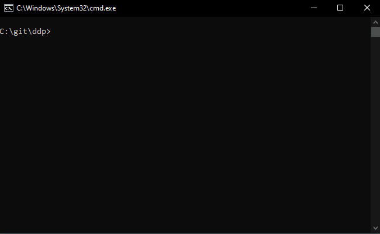

# calcular-orcamento
Projeto de console utilizando pilares de programação orientada a objetos desenvolvido como atividade inicial da diciplina de Design Patterns no Centro Universitário Eurípedes de Marília.

## Principais funcionalidades
- Atribuições de itens de orçamento
- Calculo de impostos via iterações em lista de itens

## Tecnologias usadas
- C#
- Dotnet 9.0.1

## Funcionamento

O processamento do orçamento informado em Progam.cs pode ser feito utilizando o seguinte comando da pasta raiz do projeto:

```
dotnet run

```

### Resultado

<p align="center">
    
</p>